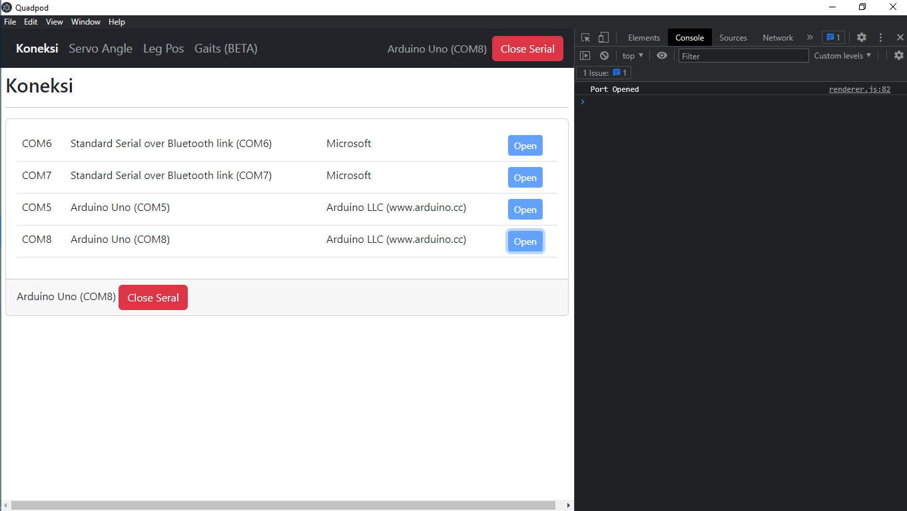
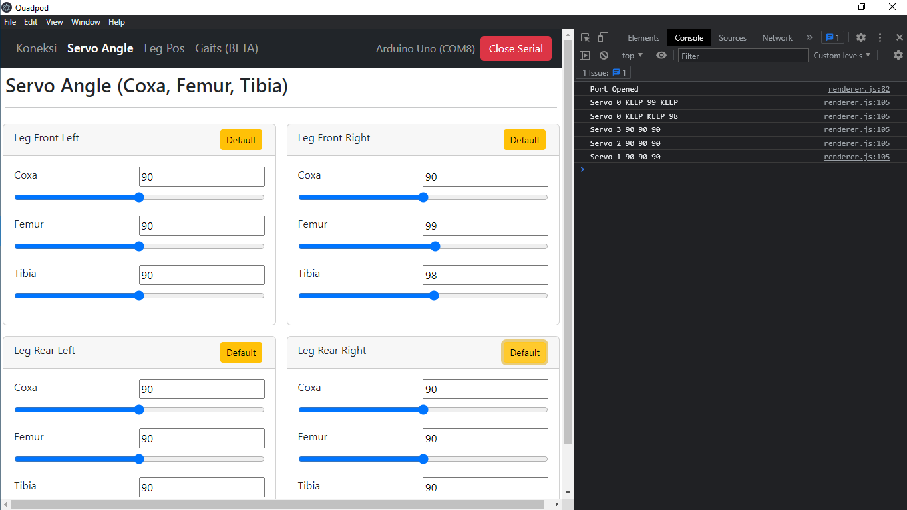
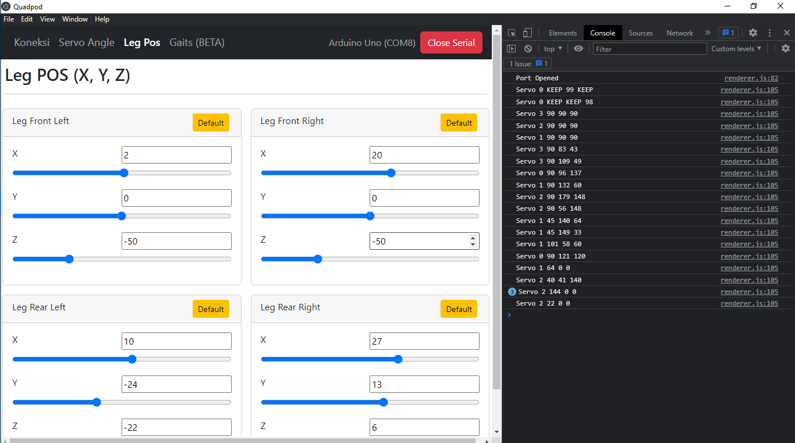
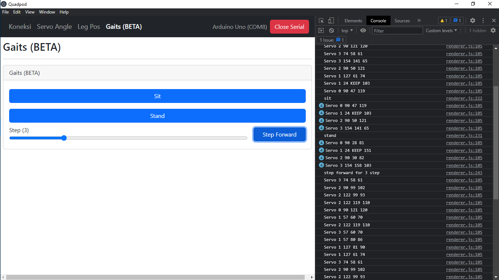

# 🕷 Quadpod Control
Aplikasi kontrol dan monitoring robot [Quadpod](https://github.com/nazililham11/Quadpod).
Basis repository [Electron SerialPort](https://github.com/serialport/electron-serialport)






## Fitur 🎯
- Menampilkan dan memilih port serial
- Mengubah sudut tiap servo 
- Mengkonversi koordinat menjadi sudut servo (Inverse Kinematic Algorithm)
- Mengubah posisi kaki berdasarkan koordinat yang ditentukan 
- **BETA** Mengubah posisi robot menjadi duduk/berdiri/maju (Gait Algorithhm)


## Cara Install 💾
Untuk menjalankan aplikasi dibutuhkan **git** dan **NodeJs** terinstall di perngkat 💻. 

```bash
# Clone this repository
git clone https://github.com/nazililham11/Quadpod_Control.git
# Go into the repository
cd electron-serialport
# Install dependencies
npm install
# Run the app
npm start
```


## Masalah yang ditemukan 🐛
- Terkadang daftar serial yang tersedia tidak muncul (Refresh / membuka ulang aplikasi bisa mengatasi masalah)
- Terkadang tidak dapat terkoneksi ke serial yang sebelumnya perna terkoneksi (Reconnect kebel bisa mengatasi masalah)
- Belum bisa mengkonversi input sudut menjadi koordinat (Kinematic Algorithm)


<style>
    img { 
        width: 50%; 
        display:block;
        float:none;
        margin-left:auto;
        margin-right:auto;
    }
</style>